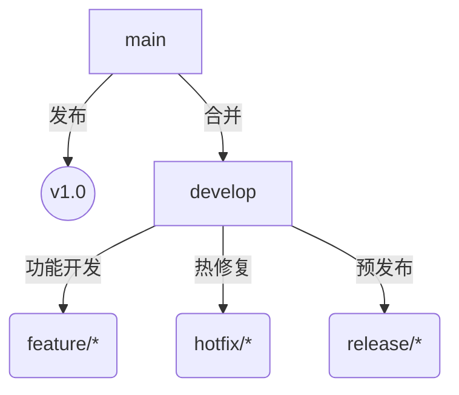

# Git 全面解析指南

## 一、Git 核心概念
### 1.1 定义与特性
- **分布式版本控制系统**：每个开发者拥有完整仓库副本（含完整历史记录）
- **核心目标**：高效管理代码变更，支持非线性开发（并行分支）
- **关键优势**：
  - 本地操作（无需网络连接）
  - 数据完整性（SHA-1哈希校验）
  - 分支/合并轻量化

### 1.2 版本控制模型对比
| **维度**        | **集中式（如SVN）**       | **分布式（Git）**          |
|-----------------|---------------------------|---------------------------|
| 仓库位置        | 单一中央服务器            | 每个用户本地拥有完整仓库    |
| 网络依赖        | 提交/更新需联网           | 多数操作可离线完成          |
| 分支操作        | 目录复制，高开销          | 指针操作，毫秒级创建        |
| 历史追溯        | 仅记录版本号              | 完整提交哈希链              |

---

## 二、Git 核心组件
### 2.1 仓库结构
```bash
.git/
├── HEAD            # 当前分支引用
├── objects/        # 数据对象（blob/tree/commit）
├── refs/           # 分支与标签指针
│   ├── heads/      # 本地分支
│   └── tags/       # 版本标签
├── config          # 仓库配置
└── index           # 暂存区状态
```

### 2.2 数据对象类型
| **类型** | **描述**                               | **示例SHA-1**          |
|----------|----------------------------------------|------------------------|
| **Blob** | 存储文件内容（二进制或文本）            | e69de29...（空文件）    |
| **Tree** | 目录结构（包含文件名、权限和子对象指针） | 92ec0b6...             |
| **Commit** | 提交元数据（作者、时间、父提交指针）    | 8d3f3a9...             |

---

## 三、Git 工作流与常用命令
### 3.1 基础工作流程
1. **初始化仓库**  
   ```bash
   git init                    # 创建新仓库
   git clone <url>             # 克隆远程仓库
   ```

2. **文件状态周期**  
   ```bash
   git add <file>              # 工作区 → 暂存区
   git commit -m "message"     # 暂存区 → 本地仓库
   git push origin main        # 本地仓库 → 远程仓库
   ```

3. **状态查看**  
   ```bash
   git status                  # 查看工作区/暂存区状态
   git log --oneline --graph   # 图形化提交历史
   ```

### 3.2 分支管理
| **操作**                | **命令示例**                             |
|-------------------------|-----------------------------------------|
| 创建分支                | `git branch feature-x`                  |
| 切换分支                | `git checkout feature-x`                |
| 合并分支（非快进）      | `git merge --no-ff feature-x`           |
| 删除已合并分支          | `git branch -d feature-x`               |
| 强制删除未合并分支      | `git branch -D feature-x`               |

### 3.3 远程协作
```bash
git remote add origin <url>     # 添加远程仓库
git fetch origin               # 获取远程更新（不合并）
git pull origin main           # 拉取并合并（= fetch + merge）
git push -u origin main        # 推送并设置上游分支
```

---

## 四、高级功能与技巧
### 4.1 代码回退与修复
| **场景**               | **解决方案**                     |
|------------------------|---------------------------------|
| 撤销工作区修改          | `git checkout -- <file>`       |
| 撤销暂存区文件          | `git reset HEAD <file>`        |
| 回退到历史提交          | `git reset --hard commit_id`   |
| 修改最后一次提交        | `git commit --amend`           |

### 4.2 贮藏与清理
```bash
git stash                      # 暂存当前修改
git stash pop                  # 恢复最近贮藏内容
git clean -fd                 # 删除未跟踪文件/目录
```

### 4.3 二分法调试
```bash
git bisect start              # 启动二分查找
git bisect bad                # 标记当前版本有问题
git bisect good v1.0          # 标记已知正常版本
# 根据测试结果继续标记good/bad
git bisect reset              # 退出二分模式
```

---

## 五、Git 分支策略
### 5.1 Git Flow 模型


### 5.2 GitHub Flow 原则
1. **main分支始终可部署**
2. 新功能通过Pull Request合并
3. 功能分支从main创建并命名明确
4. 合并前必须通过CI测试

---

## 六、Git 性能优化
### 6.1 仓库瘦身
```bash
# 清理历史大文件
git filter-branch --tree-filter 'rm -f bigfile.iso' HEAD
git reflog expire --expire=now --all
git gc --prune=now --aggressive
```

### 6.2 常用配置优化
```bash
git config --global core.preloadindex true   # 启用预加载索引
git config --global core.fscache true        # 文件系统缓存
git config --global pack.threads 0            # 自动选择压缩线程
```

---

## 七、企业级最佳实践
1. **代码审查**：强制使用Pull Request + 至少1人审核
2. **Commit规范**：遵循[Conventional Commits](https://www.conventionalcommits.org/)
3. **保护分支**：禁止直接push到main分支
4. **自动化检查**：集成ESLint/Prettier + Husky钩子
5. **备份策略**：定期镜像到多个远程仓库（GitHub + GitLab）

---

## 八、学习资源推荐
- **官方文档**：[git-scm.com/doc](https://git-scm.com/doc)
- **交互教程**：[Learn Git Branching](https://learngitbranching.js.org/)
- **书籍推荐**：
  - 《Pro Git》（免费在线阅读）
  - 《Git权威指南》
- **进阶工具**：
  - Tig（终端可视化工具）
  - LazyGit（交互式终端UI）

掌握Git需要理论与实践结合，建议在日常开发中逐步尝试高级功能！ 💻🔧