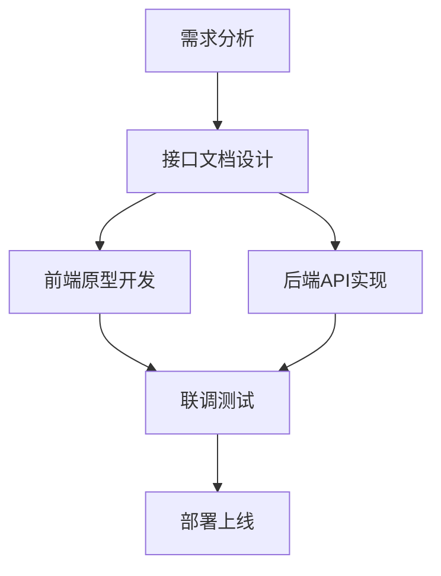

# Web 前后端开发全栈指南：技术栈与协作流程

---

## 一、前后端核心职责对比
| **维度**   | **前端（Frontend）**                | **后端（Backend）**               |
| -------- | ------------------------------- | ----------------------------- |
| **核心任务** | 用户界面实现与交互逻辑                     | 数据处理、业务逻辑与API开发               |
| **技术焦点** | 视觉效果、响应式设计、浏览器兼容性               | 数据库优化、服务器性能、安全防护              |
| **主要语言** | HTML/CSS/JavaScript             | Python/Java/Node.js/PHP/Ruby等 |
| **调试工具** | Chrome DevTools, React DevTools | Postman, Curl, Swagger        |
| **性能指标** | FCP（首次内容渲染）, TTI（可交互时间）         | QPS（每秒查询数）, 接口响应时间（P95/P99）   |

---

## 二、现代前端技术体系
### 1. 核心框架
| **框架**       | **特点**                                  | **适用场景**               |
|---------------|------------------------------------------|--------------------------|
| React         | 组件化开发，虚拟DOM优化                   | 复杂SPA应用               |
| Vue           | 渐进式框架，学习曲线平缓                  | 快速原型开发               |
| Angular       | 全功能MVC框架，适合企业级                 | 大型企业应用               |
| Svelte        | 编译时优化，无虚拟DOM                    | 高性能轻量级应用           |

### 2. 配套工具链
- **构建工具**：Webpack（模块打包）、Vite（极速HMR）  
- **CSS预处理器**：Sass/SCSS（嵌套规则）、Tailwind（原子化CSS）  
- **状态管理**：Redux（React）、Pinia（Vue）、NgRx（Angular）  
- **测试框架**：Jest（单元测试）、Cypress（E2E测试）  

---

## 三、后端开发核心技术
### 1. 主流语言与框架
| **语言**       | **流行框架**                     | **优势领域**               |
|---------------|---------------------------------|--------------------------|
| Node.js       | Express, NestJS, Koa           | 高并发I/O（实时聊天、API服务）|
| Python        | Django, Flask, FastAPI         | 数据科学、机器学习集成        |
| Java          | Spring Boot, Micronaut         | 企业级应用、微服务架构        |
| Go            | Gin, Echo                      | 高性能网络服务、云原生        |

### 2. 数据库选型指南
| **类型**       | **代表产品**               | **适用场景**               |
|---------------|---------------------------|--------------------------|
| 关系型数据库   | MySQL, PostgreSQL          | 事务处理、复杂查询           |
| 文档数据库     | MongoDB, CouchDB          | JSON数据结构、灵活模式       |
| 键值存储       | Redis, Memcached          | 缓存加速、会话存储            |
| 时序数据库     | InfluxDB, TimescaleDB      | IoT监控、实时分析            |

---

## 四、前后端通信协议与规范
### 1. API 设计规范
- **RESTful**：基于HTTP方法（GET/POST/PUT/DELETE）  
  ```bash
  GET /api/users/123      # 获取用户信息
  POST /api/orders        # 创建新订单
  ```
- **GraphQL**：灵活查询，减少请求次数  
  ```graphql
  query {
    user(id: "123") {
      name
      orders(limit: 5) {
        id, total
      }
    }
  }
  ```

### 2. 安全防护措施
- **认证授权**：JWT（JSON Web Token）+ OAuth 2.0  
- **输入验证**：使用 Zod（前端）或 Pydantic（后端）校验数据  
- **防御攻击**：  
  - XSS（跨站脚本）：内容安全策略（CSP）  
  - CSRF（跨站请求伪造）：SameSite Cookie + Token验证  

---

## 五、全栈项目开发流程
### 1. 协作流程示例


### 2. 接口文档工具
- **Swagger/OpenAPI**：自动生成可视化文档  
- **Postman Collections**：可分享的接口测试集合  
- **TypeScript类型共享**：前后端共用类型定义  
  ```typescript
  // shared/types.ts
  export interface User {
    id: string;
    name: string;
    email: string;
  }
  ```

---

## 六、部署与监控
### 1. 部署方案对比
| **平台**       | **前端部署**                | **后端部署**                |
|---------------|----------------------------|----------------------------|
| 静态托管       | Vercel, Netlify, GitHub Pages | 不适用                     |
| 云服务器       | Nginx反向代理               | Docker + Kubernetes集群     |
| Serverless     | AWS Lambda@Edge             | AWS Lambda, Vercel Serverless Functions |
| 混合部署       | CDN加速静态资源             | 云数据库（如AWS RDS）       |

### 2. 监控指标与工具
- **前端性能**：Lighthouse, Web Vitals（CLS, FID）  
- **后端监控**：Prometheus（指标收集）+ Grafana（可视化）  
- **日志分析**：ELK Stack（Elasticsearch, Logstash, Kibana）  
- **错误追踪**：Sentry, Bugsnag  

---

## 七、学习资源推荐
### 1. 系统课程
- **前端**：freeCodeCamp《Responsive Web Design》  
- **后端**：Udemy《Node.js: The Complete Guide》  
- **全栈**：The Odin Project（开源课程）  

### 2. 实战项目
- **电商平台**：React + Node.js + MongoDB  
- **博客系统**：Next.js（SSG） + Strapi（Headless CMS）  
- **实时应用**：Socket.io + Redis Pub/Sub  

---

掌握Web前后端开发需理论与实践结合，建议从简单项目入手，逐步深入架构设计与性能优化。持续关注 **Web Vitals** 和 **REST vs GraphQL** 等前沿话题，保持技术敏锐度。 🌐🚀