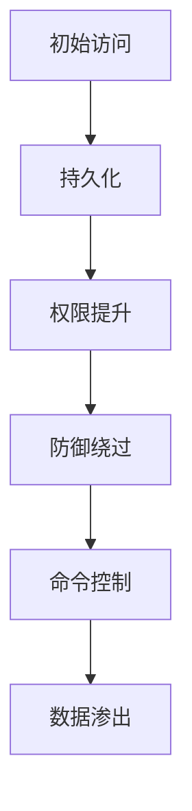

# 木马病毒深度解析：运作机制、类型与防御策略

---

## 一、木马病毒核心定义与特征
**木马病毒（Trojan Horse）** 是一类伪装成合法程序的恶意软件，其核心特征包括：
- **非自我复制**：依赖用户主动执行或社会工程诱导传播（区别于病毒和蠕虫）
- **隐蔽性**：通过进程注入、Rootkit技术隐藏自身
- **远程控制**：建立C2（Command & Control）信道接收攻击者指令
- **多重危害**：窃取数据、键盘记录、挖矿、DDoS攻击等

### 木马 vs 其他恶意软件对比
| **类型**       | 传播方式          | 主要行为                | 典型案例              |
|----------------|-----------------|-----------------------|---------------------|
| 木马           | 用户主动执行       | 远程控制、数据窃取         | Emotet、Zeus         |
| 病毒           | 感染宿主文件       | 破坏文件、自我复制         | ILOVEYOU            |
| 蠕虫           | 网络漏洞自动传播   | 消耗资源、传播自身         | WannaCry            |
| 勒索软件        | 邮件/漏洞传播     | 加密文件索要赎金          | LockBit             |

---

## 二、木马病毒技术架构与攻击链
### 1. 典型攻击流程（基于MITRE ATT&CK框架）


### 2. 关键技术模块
| **模块**        | 功能描述                          | 实现技术                    |
|----------------|---------------------------------|--------------------------|
| 载荷投递        | 诱骗用户下载执行（伪装为PDF/EXE）   | 捆绑打包、宏病毒、漏洞利用      |
| 持久化机制       | 确保重启后仍存活                   | 注册表Run键、计划任务、服务创建   |
| 通信加密        | 隐藏C2流量特征                    | TLS隧道、DNS隧道、TOR网络      |
| 功能模块        | 按需加载恶意功能                   | 插件化设计、DLL注入            |

---

## 三、木马病毒主要类型与案例
### 1. 按功能分类
| **类型**         | 攻击目标                      | 典型工具/家族            |
|------------------|-----------------------------|-----------------------|
| 银行木马          | 窃取网银凭证                  | Zeus、TrickBot         |
| RAT（远程访问木马） | 全系统控制                    | DarkComet、NjRat      |
| 挖矿木马          | 劫持CPU/GPU资源挖矿            | XMRig、CoinMiner      |
| 间谍木马          | 截屏、录音、键盘记录            | HawkEye、PredatorPain |
| 代理木马          | 构建僵尸网络（Botnet）          | Mirai、Qbot           |

### 2. 历史重大事件
- **Emotet（2014-2021）**：通过钓鱼邮件传播，造成全球超10亿美元损失  
- **Dridex（2014至今）**：针对银行客户，利用宏代码注入窃取资金  
- **QakBot（2023）**：通过OneNote附件传播，窃取企业OA系统凭证  

---

## 四、木马病毒检测与分析技术
### 1. 静态分析
- **文件哈希校验**：对比VirusTotal等平台已知恶意哈希  
- **字符串提取**：查找可疑API调用（如`CreateRemoteThread`）  
- **熵值检测**：高熵值提示加密或压缩（UPX等壳特征）  

### 2. 动态分析
- **沙箱检测**：Cuckoo Sandbox、AnyRun监测行为链  
- **API监控**：使用Process Monitor记录注册表/文件操作  
- **网络流量分析**：Wireshark检测异常DNS请求或C2 IP连接  

### 3. 逆向工程
```python
# IDA Pro反汇编查找关键函数
seg000:00401000 push    offset aHelloWorld ; "Hello, World!"
seg000:00401005 call    ds:printf
```

---

## 五、防御与清除策略
### 1. 企业级防护方案
| **层级**        | 防护措施                          | 工具/技术                  |
|----------------|---------------------------------|--------------------------|
| 终端防护         | EDR实时监控（行为分析）            | CrowdStrike Falcon        |
| 网络流量         | NGFW阻断C2通信                    | Palo Alto WildFire       |
| 邮件网关         | 附件沙箱检测                       | Proofpoint TAP           |
| 漏洞管理         | 定期修补CVE漏洞                    | Tenable Nessus           |

### 2. 个人防护指南
- **软件来源控制**：仅从官方商店下载应用，禁用Office宏  
- **权限最小化**：日常使用非管理员账户  
- **多因素认证**：关键账户启用MFA（如Google Authenticator）  
- **应急响应**：  
  - 断网隔离感染设备  
  - 使用RKill终止可疑进程  
  - 全盘扫描（Malwarebytes、HitmanPro）  

---

## 六、法律与伦理警示
- **《网络安全法》**：制作传播木马可处3年以下有期徒刑或罚金  
- **GDPR合规**：企业因木马导致数据泄露最高罚款全球营收4%  
- **白帽规范**：渗透测试需获得书面授权，禁止非法控制他人设备  

---

木马病毒的对抗是持续演进的过程，建议采用**纵深防御体系**（Defense in Depth）并定期开展红蓝演练。保持系统更新与安全意识教育是防御关键。 🔒🛡️