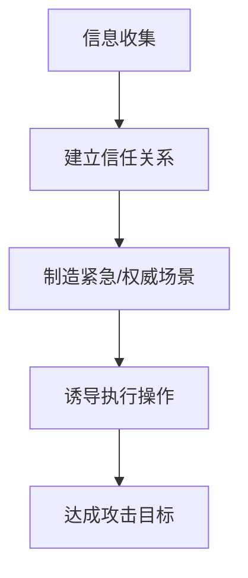

# 社会工程学深度解析：攻防策略与人类漏洞利用

---

## 一、社会工程学定义与核心逻辑
**社会工程学（Social Engineering）** 是一种通过**心理操纵**与**人际互动技巧**获取敏感信息或非法访问权限的攻击手段，其本质是**绕过技术防线，直接利用人性弱点**。根据 Verizon《2023年数据泄露调查报告》，**74%的安全漏洞涉及人为因素**，其中社会工程学攻击占比高达 83%。

### 攻击链模型（基于 MITRE ATT&CK 框架）：

---

## 二、常见攻击手段与经典案例
### 1. 钓鱼攻击（Phishing）
| **类型**        | **特征**                         | **典型案例**                     |
|-----------------|----------------------------------|---------------------------------|
| 邮件钓鱼         | 仿冒官方邮件要求重置密码           | 2022年 Twilio 员工被钓鱼，导致 Signal 数据泄露 |
| 短信钓鱼（Smishing）| 含恶意链接的"银行通知"短信         | 2023年 美国 T-Mobile 员工被钓鱼致内部系统沦陷 |
| 语音钓鱼（Vishing）| 冒充客服索取验证码                 | 2021年 加密货币交易所用户遭语音诈骗损失$140万 |
| 鱼叉式钓鱼       | 针对高价值目标的定制化钓鱼          | 2016年 希拉里竞选团队主席邮箱被定向钓鱼攻破 |

**技术细节**：  
- **域名伪造**：使用 `micros0ft.com`（字母o替换为数字0）  
- **邮件头伪造**：修改 `From:` 字段为可信来源  
- **二维码钓鱼**：公共场所张贴虚假WiFi登录二维码  

### 2. 诱导式攻击（Pretexting）
- **冒充场景**：  
  - 技术支持："检测到您电脑有病毒，需远程协助清除"  
  - 快递客服："包裹被海关扣留，请确认支付清关费用"  
  - 公司高管："我是CEO，急需财务部立即支付一笔款项"  

- **心理学机制**：  
  - **权威原则**：伪造警号/工牌编号增加可信度  
  - **稀缺性原理**："限时优惠只剩最后1个名额"  
  - **互惠心理**：先提供免费安全检测再索要权限  

### 3. 物理渗透攻击
| **手段**        | **操作方式**                     | **防御难点**                 |
|-----------------|----------------------------------|----------------------------|
| 尾随进入（Piggybacking） | 跟随员工通过门禁                 | 生物识别系统存在1.2%的误接受率 |
| USB丢弃攻击      | 在停车场放置带恶意程序的U盘         | 60%的人会插入未知U盘并打开文件 |
| 肩窥（Shoulder Surfing）| 在咖啡厅偷看他人输入密码          | 公共场合隐私保护意识薄弱        |

**渗透测试案例**：  
- **DEF CON 大会挑战**：2019年参赛者通过伪造工牌和维修工服装，成功进入90%企业的敏感区域  
- **垃圾桶翻查（Dumpster Diving）**：回收未碎纸的客户名单获取攻击目标  

---

## 三、社会工程学防御体系
### 1. 企业级防护策略
**技术层**：  
- **邮件安全网关**：使用 AI 检测伪造邮件头（如 Abnormal Security 检测精度达 99.8%）  
- **多因素认证（MFA）**：强制硬件密钥（YubiKey）或生物特征验证  
- **零信任架构**：持续验证设备/用户状态，默认不信任任何内部请求  

**管理层**：  
- **最小权限原则**：财务人员仅能访问必要支付系统  
- **红蓝对抗演练**：每季度模拟钓鱼测试并公布点击率排名  
- **数据分类标记**：对敏感文件添加"内部机密-禁止外发"水印  

### 2. 个人防护指南
**意识培养**：  
- **S.H.I.E.L.D 原则**：  
  - **S**crutinize（仔细核查）：确认对方身份需通过官方回拨  
  - **H**esitate（暂缓行动）：对"紧急要求"至少等待15分钟  
  - **I**dentify red flags（识别红旗）：要求提供密码或转账即为高危信号  
  - **E**ncrypt（加密通信）：敏感对话使用 Signal 或 ProtonMail  
  - **L**imit exposure（减少暴露）：社交媒体不透露宠物名（常用密码提示问题）  
  - **D**ocument（记录证据）：保存可疑信息截图报备IT部门  

**技术工具**：  
- **虚拟号码**：使用 Google Voice 应对陌生来电  
- **密码管理器**：1Password 或 Bitwarden 生成/存储高强度密码  
- **隐私保护插件**：uBlock Origin 拦截钓鱼网站，DuckDuckGo 屏蔽追踪器  

---

## 四、顶级黑客的心理学武器库
### 1. 神经语言程序学（NLP）技巧
- **镜像匹配**：模仿对方语速和用词风格建立亲和感  
- **嵌入式命令**：在正常对话中插入指令（"您现在可以**点击链接**查看工单进度"）  
- **双重束缚**：提供两个选项均有利于攻击者（"您希望今天还是明天处理账户异常？"）  

### 2. 微表情识别与利用
| **表情**   | **对应情绪** | **攻击者应对策略**          |
|------------|-------------|---------------------------|
| 眉毛上扬    | 惊讶/怀疑    | 立即提供"官方文件"打消疑虑     |
| 嘴唇紧闭    | 犹豫不决     | 施加时间压力（"5分钟后系统将锁定"） |
| 频繁眨眼    | 紧张焦虑     | 转为温和语气降低防御心理       |

---

## 五、法律边界与伦理争议
### 1. 典型法律案件
- **美国诉凯文·米特尼克（1995）**：因社会工程学入侵被判刑46个月，开创黑客犯罪量刑先例  
- **欧盟 GDPR 第33条**：要求企业72小时内报告社会工程学导致的数据泄露  

### 2. 道德准则争议
- **白帽黑客**：渗透测试需获得书面授权，禁止利用获取的信息谋利  
- **红队演练争议**：是否允许使用伪造紧急事件测试员工反应（如假火警疏散时窃取未锁设备）  

---

社会工程学既是攻击者的利器，也是防御者的必修课。通过理解其运作机制并构建**人技结合**的防御体系，才能有效抵御这场针对人性的隐秘战争。持续教育和技术创新是应对这一挑战的核心策略。 🔐👤