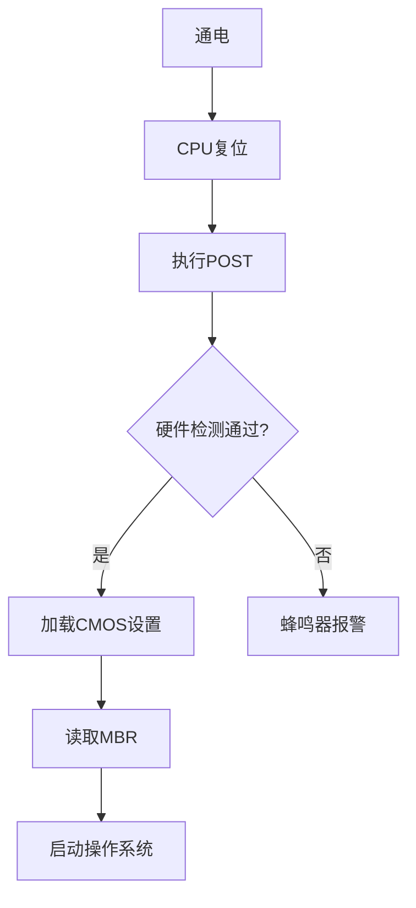

# BIOS 深度解析：从基础到高级管理

---

## 一、BIOS 的核心定义与历史沿革

### 1. 基本概念
**BIOS**（Basic Input/Output System）是计算机启动时最先加载的固件程序，负责**硬件初始化**、**系统自检（POST）** 和**启动引导**。其核心功能包括：
- **硬件检测**：识别CPU、内存、存储设备等关键组件
- **引导加载**：定位并加载操作系统引导程序（如MBR）
- **配置接口**：提供CMOS设置界面调整硬件参数

### 2. 发展历程
| **年代** | **技术演进**                          | **代表产品**               |
|---------|-------------------------------------|--------------------------|
| 1975     | 首个BIOS概念在Altair 8800实现          | CP/M BIOS                |
| 1981     | IBM PC 标准化 BIOS 架构                | IBM PC BIOS              |
| 1996     | 支持即插即用（PnP）和ACPI电源管理        | Phoenix BIOS 4.0         |
| 2005     | UEFI 开始逐步替代传统 BIOS              | Intel EFI 1.10           |
| 2020     | 传统 BIOS 退出主流市场（仅部分工控机保留） | AMI Aptio 5              |

---

## 二、BIOS 功能模块解析

### 1. 核心组件
| **模块**          | **功能描述**                          | **存储位置**             |
|-------------------|-------------------------------------|--------------------------|
| POST 程序          | 开机自检（Power-On Self-Test）        | BIOS 芯片（SPI Flash）   |
| 中断向量表         | 提供硬件操作的中断服务程序（INT 13h访问磁盘） | 内存映射区域（0x000-0x3FF）|
| CMOS 设置程序      | 用户可配置参数（日期、启动顺序）          | 独立CMOS芯片（由纽扣电池供电）|
| 引导加载程序       | 读取MBR并移交控制权给操作系统           | 硬盘首个扇区（512字节）     |

### 2. 启动流程


---

## 三、BIOS 设置与操作指南

### 1. 进入 BIOS 的方法
| **品牌**       | **按键**        | **特殊说明**                     |
|---------------|----------------|---------------------------------|
| 戴尔 Dell     | F2/F12         | 服务器型号需按 Ctrl+E            |
| 惠普 HP        | F10/Esc        | 部分机型需快速连按                 |
| 联想 Lenovo    | F1/F2          | 笔记本需先按 Fn+F2               |
| 华硕 ASUS      | Del/F2         | ROG系列需开机时按住电源键强制进入    |
| 苹果 Mac       | Option+Cmd+P+R | Intel芯片机型适用，M系列芯片无传统BIOS|

### 2. 关键配置项解析
| **菜单项**       | **推荐设置**                  | **风险提示**                |
|-----------------|-----------------------------|---------------------------|
| Boot Order      | 硬盘优先 > 光驱 > 网络          | 错误设置可能导致系统无法启动     |
| SATA Mode       | AHCI（SSD必选）/IDE（旧系统兼容）| RAID模式需额外驱动           |
| CPU Settings    | 谨慎调整倍频/电压（超频风险）      | 不当超频可能损坏硬件          |
| Secure Boot     | 启用（需操作系统支持）           | 可能阻止Linux Live USB启动   |
| TPM Configuration| 启用（Windows 11强制要求）       | 影响BitLocker加密功能        |

---

## 四、BIOS 升级与维护

### 1. 升级步骤（以AMI BIOS为例）
1. **准备文件**：从官网下载对应型号的 `.ROM` 文件（如 `X570_BIOS_2305.rom`）  
2. **制作启动盘**：格式化为FAT32，放置BIOS文件和刷新工具（如 `afudos.exe`）  
3. **进入DOS环境**：通过U盘启动到FreeDOS  
4. **执行刷新**：  
   ```bash
   afudos X570_BIOS_2305.rom /p /b /n /x
   ```
5. **重启验证**：进入BIOS查看版本号  

### 2. 风险规避
- **双BIOS设计**：华硕/技嘉主板支持主副BIOS自动恢复  
- **断电保护**：使用UPS确保升级过程不断电  
- **版本验证**：通过 `afudos /o bios.rom` 备份当前BIOS并比对哈希值  

---

## 五、BIOS 安全与破解

### 1. BIOS 密码破解
| **方法**        | **操作步骤**                            | **适用场景**             |
|-----------------|---------------------------------------|------------------------|
| CMOS放电        | 断开纽扣电池1分钟，重置CMOS              | 台式机/可拆卸电池笔记本   |
| 主密码破解       | 使用 `bios-pw.org` 查询厂商万能密码        | 戴尔/惠普部分旧机型       |
| 编程器重写       | CH341A编程器读取SPI Flash芯片并擦除密码    | 高端主板/无物理访问限制   |

### 2. 固件级漏洞
- **CVE-2017-3197**：华硕主板固件更新未签名验证，允许植入恶意代码  
- **Thunderstrike 2**：通过雷电接口注入恶意固件（影响Mac设备）  
- **防护建议**：启用固件写保护（`BIOS Write Protect` 选项）  

---

## 六、传统 BIOS 与 UEFI 对比

| **特性**          | **传统 BIOS**                     | **UEFI**                          |
|-------------------|----------------------------------|-----------------------------------|
| **图形界面**       | 文本模式（16色）                  | 图形化GUI（支持鼠标/触摸）          |
| **硬盘支持**       | MBR（最大2TB）                   | GPT（最大9.4ZB）                  |
| **启动速度**       | 慢（顺序初始化）                  | 快（并行驱动加载）                 |
| **安全功能**       | 无                               | Secure Boot、TPM 2.0             |
| **网络支持**       | 有限（PXE需额外驱动）              | 内置网络协议栈（HTTP/HTTPS）       |

---

通过深入理解 BIOS 的工作原理与操作技巧，用户可有效解决硬件兼容性问题、优化系统性能，并为高级维护（如超频调试）奠定基础。对于现代设备，建议优先掌握 UEFI 相关技术以应对新硬件特性。 🔧💻